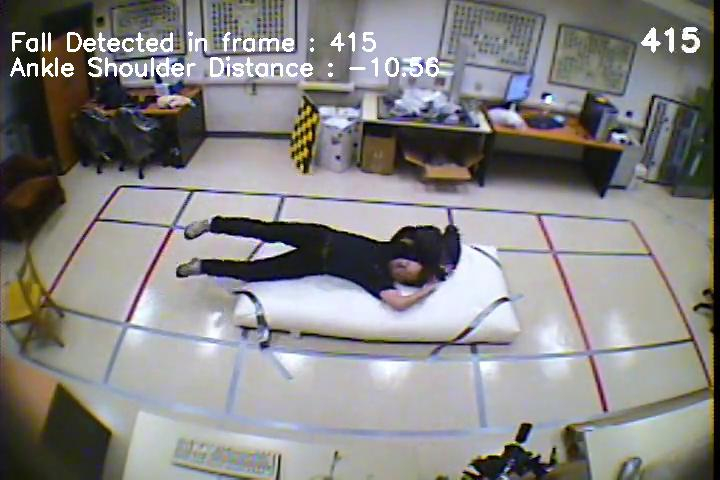

# Panorama Fall Detection Example

### Use Case
Automated **Fall Detection** has been popular in applications like detecting the fall of the elderly , factory workers etc. Several algorithms have been developed based on sensor readings and camera recordings ranging from classical ML based models to Deep Learning based models.

Training a custom Fall Detection model would require creating a labelled dataset of images/vidoes. Instead, in this notebook, we will explore how we can utilize existing pretrained Pose Estimation models, to create a rule based solution for fall detection.

### Files Included

- [Lambda](Lambda/) (Folder)
    - [utils.py](Lambda/utils.py)
    - [fall_detector.py](Lambda/fall_detector.py)
    - [fall-detection.zip](Lambda/fall-detection.zip)
- [Notebook](Notebook/) (Folder)
    - [FallDetection-Panorama-Examples.ipynb](Notebook/FallDetection-Panorama-Examples.ipynb)
    - [utils.py](Notebook/utils.py)
    - [nb_utils.py](Notebook/nb_utils.py)
    - [sample_video.mp4](Notebook/sample_video.mp4)
    - [Example Output Image](Example_Output.jpg)

### How to use the Notebook

The included Jupyter Notebook gives a helpful introduction of 
- Task at hand 
- Step by step walk through of modelling approach
- Understanding the Lambda structure by creating code in the same format
- Creating an AWS Lambda function by uploading the included Lambda zip file
- Publishing the Lambda

Use `mxnet_p36` kernel in Amazon SageMaker and pip install `gluoncv` library

### Example Output From Notebook

The output displays the frame number where a fall was detected and the corresponding metric.

### How to use the Lambda Function

The included Lambda function is a zip file that can be directly uploaded to the Lambda console to create a usable Lambda ARN. 

### Other resources to use

- [Panorama Lambda User Guide](https://docs.aws.amazon.com/panorama/)