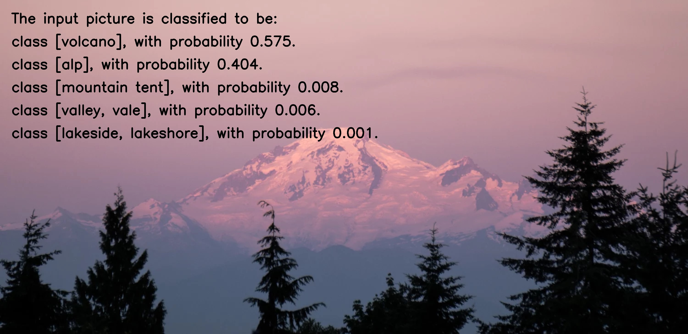

# Panorama Image Classification Example

This is an end to end example that shows how to use an image classification model to classify video frames in the video stream.

## Files Included
- Lambda (Folder)
	- imagenet_classes.py 
	- classification.py
	- image-classification.zip
- Notebook(Folder)
	- Image-Classification-Example.ipynb
    - mt_baker.jpg

mt_baker_output.jpg (Example output)
resnet50_v2.tar.gz (Model to Use)

### Use Case
- Classify a video frame using 1000 classes from imagenet using resent50_v2 model. 
- Once a video frame is classified, it can be used as input to perform the business logic.

### How to use the Notebook
The included Jupyter Notebook gives a helpful introduction of 
- Task at hand 
- Step by step walk thru of the MXNet code
- Understanding the Lambda structure by creating code in the same format
- Creating a Lambda function by uploading the included Lambda zip file
- Publishing the Lambda and displaying the version number and the Lambda console link

### Example Output From Notebook

The output displays the top 5 classes the image may belong to. 

### How to use the Lambda Function

The included Lambda function is a zip file that can be directly uploaded to the Lambda console to create a usable Lambda arn. 

### Other resources to use

- [AWS Panorama Documentation](https://docs.aws.amazon.com/panorama/)
