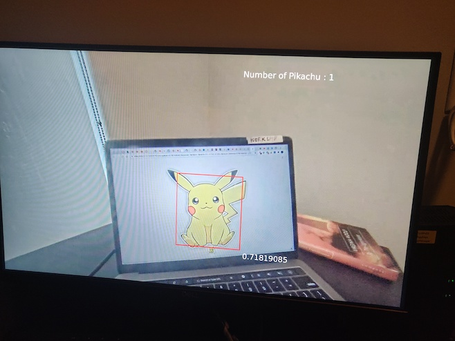

# Panorama Custom Object Detector Example (Pikachu Detection)

This is an end to end example that shows how to create a custom Object Detector using GluonCV and using it on the Panorama device

## Files Included
- Lambda (Folder)
	- PikachuDetection.zip
- Notebook(Folder)
	- pikachu_detection_custom_object_detector.ipynb

### Use Case
- Build a custom object detector that uses transfer learning to detect Pokemon (pikachu) in an image
- Details how to loop in annotations, creating the model and exporting the hybridized model
- The lambda also counts the number of pikachu detected in the frame and displays it on the output HDMI

### How to use the Notebook
The included Jupyter Notebook gives a helpful introduction of 
- Task at hand 
- Step by step walk thru of how to train your own Object Detector
- Exporting the model and creating a tar.gz file with the parameters
- Upload the model to S3 bucket
- Create and publish a lambda function with the included Lambda zip file

### Example Output From Notebook

An example output display is shown here

### How to use the Lambda Function

The included Lambda function is a zip file that can be directly uploaded to the Lambda console to create a usable Lambda arn. 

### Other resources to use

- [AWS Panorama Documentation](https://docs.aws.amazon.com/panorama/)
- [Create Your Own COCO Dataset](https://gluon-cv.mxnet.io/build/examples_datasets/mscoco.html#sphx-glr-build-examples-datasets-mscoco-py)
- [Create Your Own VOC Dataset](https://gluon-cv.mxnet.io/build/examples_datasets/pascal_voc.html#sphx-glr-build-examples-datasets-pascal-voc-py)
- [sphx-glr-build-examples-datasets-detection-custom](https://gluon-cv.mxnet.io/build/examples_datasets/detection_custom.html#sphx-glr-build-examples-datasets-detection-custom-py)
