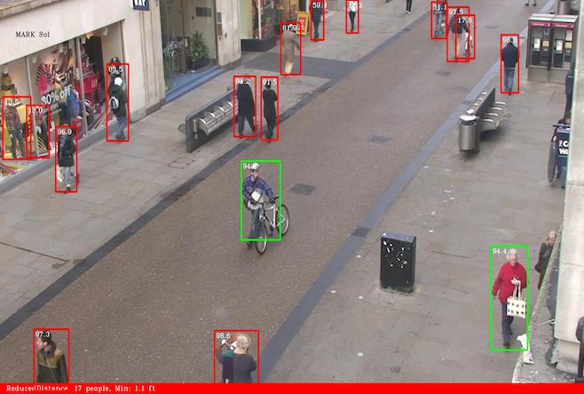

# Panorama Social Distance Calculation Example

This is an end to end example that shows how to use a people detector model to calculate and identify social distance violations in real time

## Files Included
- Lambda (Folder)
	- ModelOutput.py 
	- lambda_function.py
	- socialDistance.py
	- SocialDistanceDetection.zip
	- socialDistanceUtils.py
- Notebook(Folder)
	- Social_Distancing.ipynb
	- DistanceCalc4.png
	- socialDistanceUtils.py
	- socialDistance.py

- ssd_512_resnet50_v1_voc.tar.gz (model to use)
- TownCentreXVID.avi (Video to Use)

### Use Case
- Detect Social Distancing violations in real time using an open source people detection model
- People violating social distance threshold are marked in a red bounding box
- People adhering to SD thresholds are marked in a green bounding box

### How to use the Notebook
The included Jupyter Notebook gives a helpful introduction of 
- Task at hand 
- Step by step walk thru of the MXNet code
- Understanding the Lambda structure by creating code in the same format
- Creating a Lambda function by uploading the included Lambda zip file
- Publishing the Lambda and displaying the version number and the Lambda console link

### Example Output From Notebook

The output displays the example SD calculation. 

### How to use the Lambda Function

The included Lambda function is a zip file that can be directly uploaded to the Lambda console to create a usable Lambda arn. 

### Other resources to use

- [AWS Panorama Documentation](https://docs.aws.amazon.com/panorama/)
